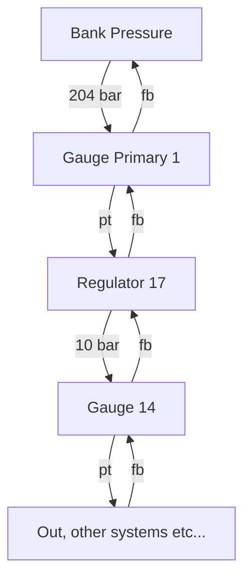

## Eksempel

```mermaid
flowchart TD;
    A[Bank Pressure] -- 204 bar --> B;
    B -- fb --> A;
    B[Gauge Primary 1] -- pt --> C;
    C -- fb --> B;
    C[Regulator 17] -- 10 bar --> D;
    D -- fb --> C;
    D[Gauge 14] -- pt --> F;
    F -- fb --> D;
    F[Out, other systems etc...]
```

- fb -> feedback
- pt -> pass through