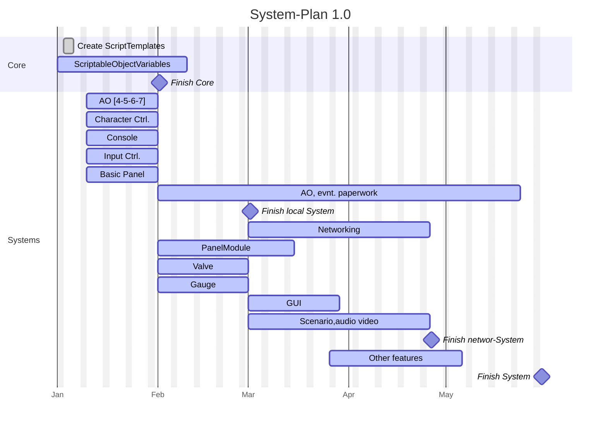

```mermaid
gantt
    dateFormat  YYYY-MM-DD
    axisFormat  %b
    todayMarker off
    title       System-Plan 1.0
    excludes    weekends

    section Core
    Create ScriptTemplates      :done, st, 2022-01-03, 3d
    ScriptableObjectVariables   :active, sv, 2022-01-01, 2022-02-10
    Finish Core                 :milestone, m1, 2022-02-01, 1d

    section Systems
    AO [4-5-6-7]                :active, pw, 2022-01-10, 16d
    Character Ctrl.        :active, ch, 2022-01-10, 16d
    Console                     :active, co, 2022-01-10, 16d
    Input Ctrl.            :active, in, 2022-01-10, 16d
    Basic Panel                 :active, pa, 2022-01-10, 16d
    AO, evnt. paperwork         :active, pw, 2022-02-01, 80d
    Finish local System         :milestone, m2, 2022-03-01, 1d
    Networking                  :active, ne, 2022-03-01, 40d
    PanelModule                 :active, pm, 2022-02-01, 30d
    Valve                       :active, va, 2022-02-01, 20d
    Gauge                       :active, ga, 2022-02-01, 20d
    GUI                         :active, gu, 2022-03-01, 20d
    Scenario,audio video         :active, av, 2022-03-01, 40d
    Finish networ-System        :milestone, m2, 2022-04-26, 1d
    Other features              :active, va, 2022-03-26, 30d
    Finish System               :milestone, m2, 2022-05-30, 1d
```