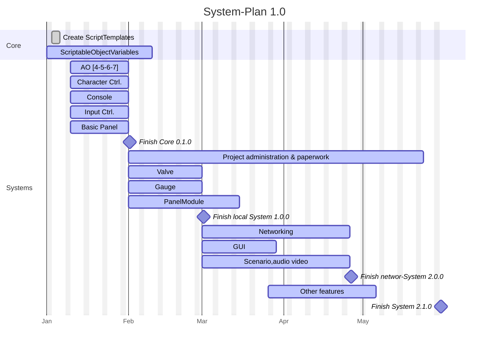

```mermaid
gantt
    dateFormat  YYYY-MM-DD
    axisFormat  %b
    todayMarker off
    title       System-Plan 1.0
    excludes    weekends

    section Core
    Create ScriptTemplates      :done, st, 2022-01-03, 3d
    ScriptableObjectVariables   :active, sv, 2022-01-01, 2022-02-10
    

    section Systems
    AO [4-5-6-7]                        :active, pw, 2022-01-10, 16d
    Character Ctrl.                     :active, ch, 2022-01-10, 16d
    Console                             :active, co, 2022-01-10, 16d
    Input Ctrl.                         :active, in, 2022-01-10, 16d
    Basic Panel                         :active, pa, 2022-01-10, 16d
    Finish Core 0.1.0                   :milestone, m1, 2022-02-01, 1d

    Project administration & paperwork  :active, pw, 2022-02-01, 80d
    Valve                               :active, va, 2022-02-01, 20d
    Gauge                               :active, ga, 2022-02-01, 20d
    PanelModule                         :active, pm, 2022-02-01, 30d
    Finish local System 1.0.0           :milestone, m2, 2022-03-01, 1d

    Networking                          :active, ne, 2022-03-01, 40d
    GUI                                 :active, gu, 2022-03-01, 20d
    Scenario,audio video                :active, av, 2022-03-01, 40d
    Finish networ-System 2.0.0          :milestone, m2, 2022-04-26, 1d

    Other features                      :active, va, 2022-03-26, 30d
    Finish System 2.1.0                 :milestone, m2, 2022-05-30, 1d
```

